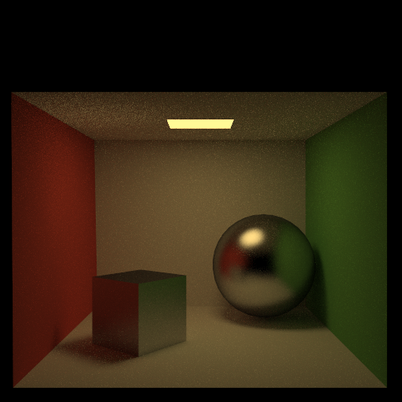
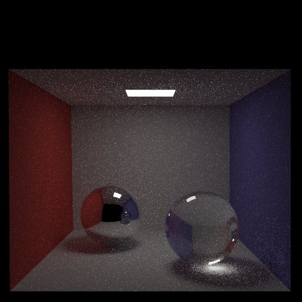
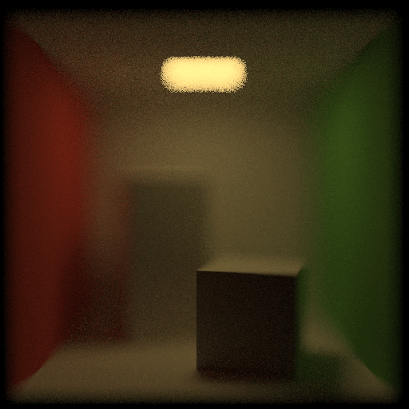

# Pathtracer
I created a Monte-Carlo simulation pathtracer to physically render OBJ files with soft shadows, area lights, refraction, glossy and reflective surfaces, adjustable depth of field, and BRDF importance sampling.

Glossy and reflective surfaces:

Attenuative refraction and reflection:

Depth of field:

